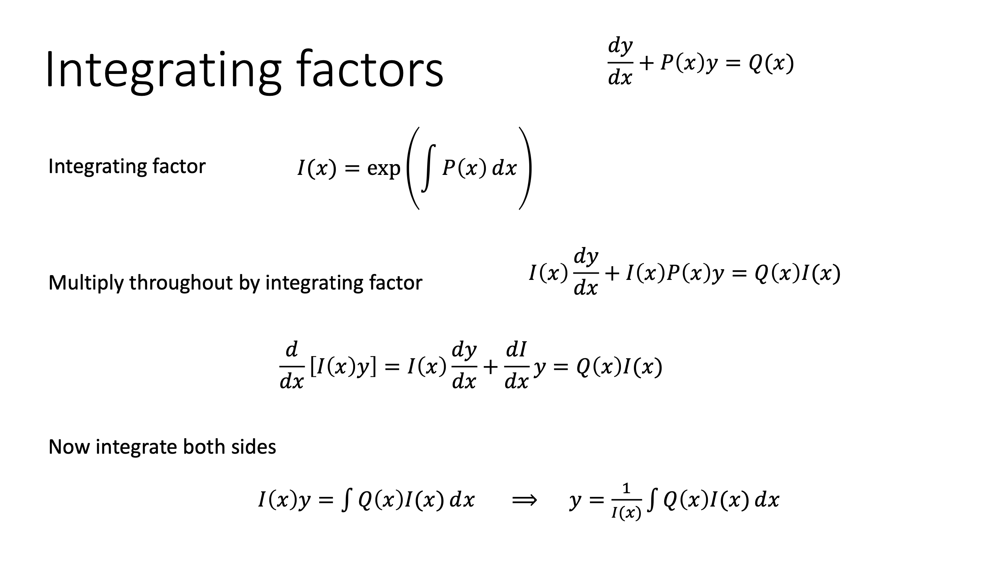

# ACS234 - Mathematics and Data Modelling 

## Differential Equations

### 1st order 

If you need to solve a linear first order differential equation, you can use the "integrating factor" method.

See **1st_order.pdf** for examples.
 
 
 
 ### 2nd order

For homogeneous second order differential equation, please see the method below : 

 See **2nd_order.pdf** for examples.